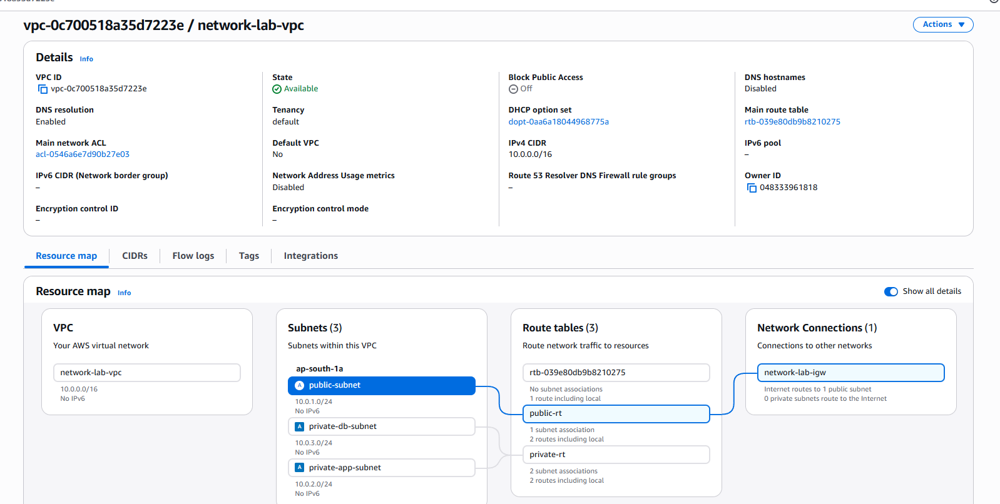
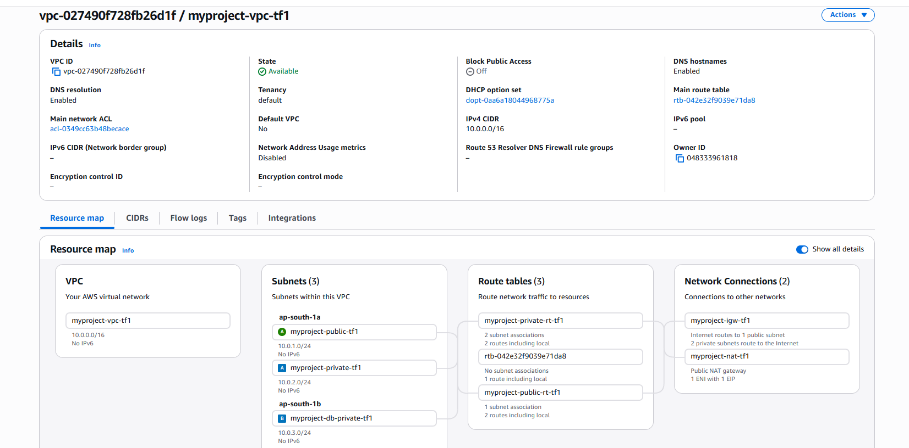
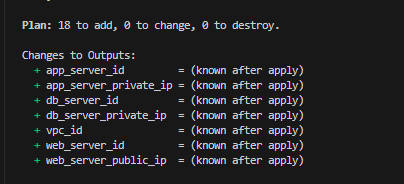
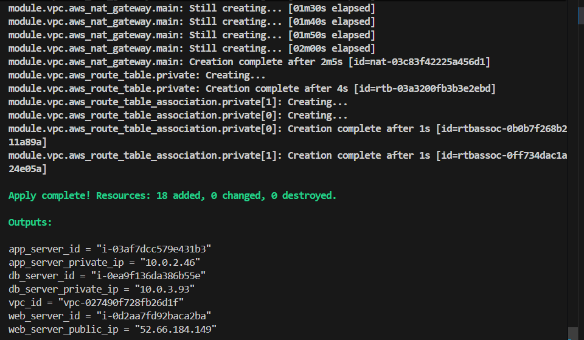
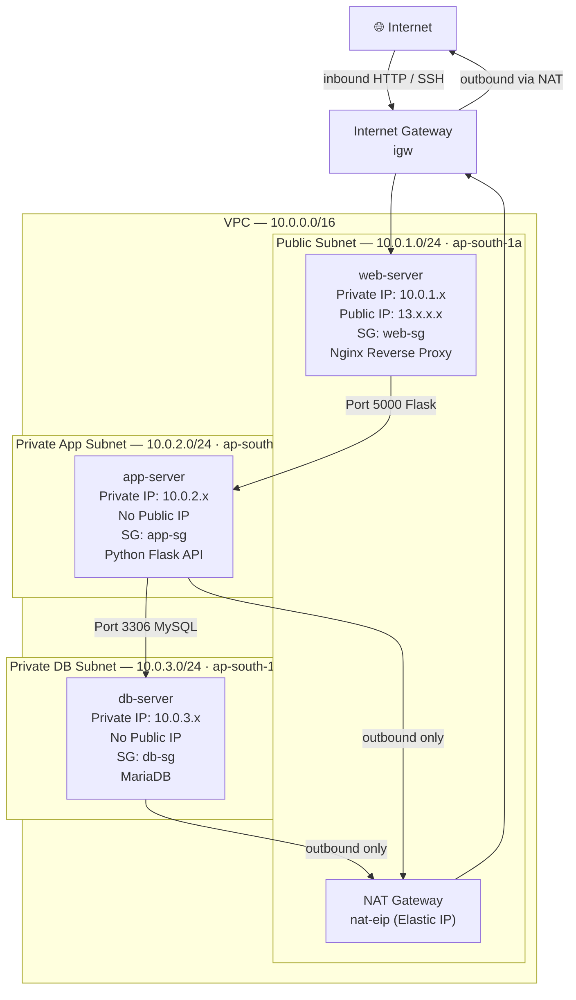

# AWS 3-Tier Architecture

A production-style 3-tier architecture on AWS, built both manually and as Infrastructure as Code using Terraform.

**Region:** `ap-south-1` (Mumbai) · **Stack:** Nginx → Flask → MariaDB

---

# AWS 3-Tier Architecture — Network Design
### VPC: `network-lab-vpc` · CIDR: `10.0.0.0/16` · Region: `ap-south-1` (Mumbai)
### VPC Resource Map with Manual Setup
Full network topology — VPC, subnets, IGW, NAT Gateway, and route tables.



### VPC Resource Map with Terraform Setup



##terraform Plan->



##terraform apply->



## Full Architecture




---

## Traffic Flow — End to End

```
User Browser
    │
    │  HTTP Port 80
    ▼
Internet Gateway
    │
    ▼
web-server (public subnet)
    │  Nginx proxies request
    │  Port 5000
    ▼
app-server (private subnet)
    │  Flask queries database
    │  Port 3306
    ▼
db-server (private subnet)
    │  MariaDB returns data
    ▼
app-server → web-server → User Browser
```


---

## Project Structure

```
aws-3tier-architecture/
├── docs/
│   ├── manual-setup-steps.md        ← Step-by-step manual AWS setup with screenshots
│   └── TERRAFORM_3TIER_LEARNING_v1.md  ← Terraform IaC guide with architecture + flowcharts
├── src/
│   ├── app/                         ← Python Flask application
│   ├── db/                          ← Database init scripts
│   └── web/                         ← Nginx configuration
└── terraform-aws-labv1/             ← Terraform modules (VPC, Security Groups, EC2)
```

---

## Approaches

###  Setup Documents
Step-by-step guide covering VPC, subnets, NAT Gateway, security groups, EC2 provisioning, and MariaDB configuration.

→ See [docs/manual-setup-steps.md](docs/manual-setup-steps.md)

### Terraform (IaC)
Modular Terraform setup that recreates the full stack as code. Covers module structure, value flow, NAT Gateway, security group chaining, and deployment commands.

→ See [docs/TERRAFORM_3TIER_LEARNING_v1.md](docs/TERRAFORM_3TIER_LEARNING_v1.md)

---

## Prerequisites

- AWS Account with IAM permissions (EC2, VPC, Security Groups)
- AWS CLI configured (`aws configure`)
- Terraform >= 1.0
- Python 3.8+

---

## Quick Deploy (Terraform)

```bash
cd terraform-aws-labv1/
terraform init
terraform plan -out=tfplan
terraform apply tfplan

# Destroy when done to avoid charges
terraform destroy
```


---

## License

MIT License — see [LICENSE](LICENSE) for details.
