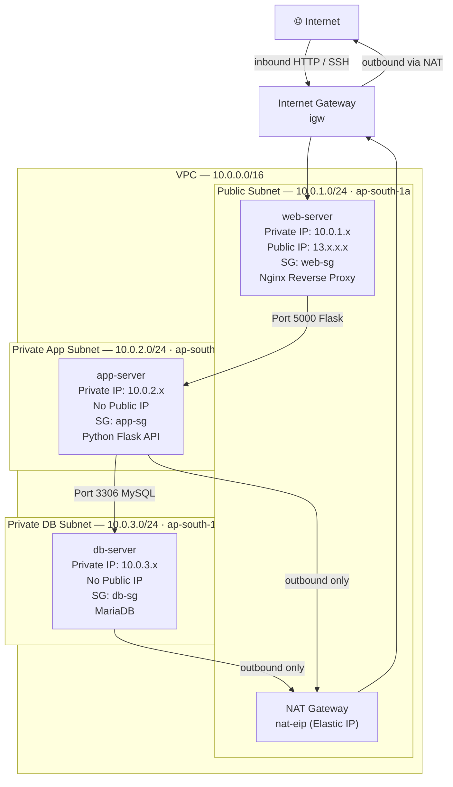
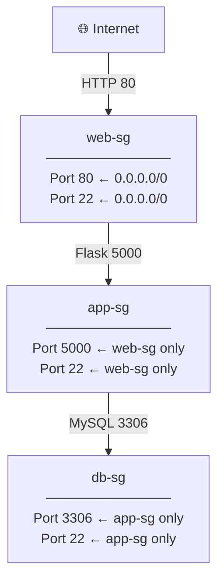
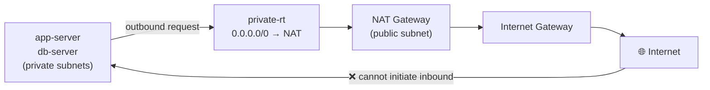

# AWS 3-Tier Architecture

A production-style 3-tier architecture on AWS, built both manually and as Infrastructure as Code using Terraform.

**Region:** `ap-south-1` (Mumbai) · **Stack:** Nginx → Flask → MariaDB

---

## Architecture

```
          Internet
              │
              ▼
      [ web-server ]        ← Public Subnet  · Nginx Reverse Proxy
              │
              ▼
      [ app-server ]        ← Private Subnet · Python Flask API
              │
              ▼
      [ db-server  ]        ← DB Subnet      · MariaDB
```
# AWS 3-Tier Architecture — Network Design
### VPC: `network-lab-vpc` · CIDR: `10.0.0.0/16` · Region: `ap-south-1` (Mumbai)

---

## Full Architecture



---

## Subnets

| Subnet | CIDR | AZ | Route Table | Purpose |
|---|---|---|---|---|
| Public | `10.0.1.0/24` | ap-south-1a | public-rt | Web server + NAT Gateway |
| Private App | `10.0.2.0/24` | ap-south-1a | private-rt | Flask application server |
| Private DB | `10.0.3.0/24` | ap-south-1b | private-rt | MariaDB database server |

---

## Route Tables

### `public-rt` — attached to Public Subnet
| Destination | Target | Purpose |
|---|---|---|
| `10.0.0.0/16` | local | Internal VPC traffic |
| `0.0.0.0/0` | IGW | Internet access |

### `private-rt` — attached to App + DB Subnets
| Destination | Target | Purpose |
|---|---|---|
| `10.0.0.0/16` | local | Internal VPC traffic |
| `0.0.0.0/0` | NAT Gateway | Outbound-only internet |

---

## Security Groups



| Security Group | Inbound Port | Source | Purpose |
|---|---|---|---|
| `web-sg` | 80 | `0.0.0.0/0` | Public HTTP traffic |
| `web-sg` | 22 | `0.0.0.0/0` | Admin SSH access |
| `app-sg` | 5000 | `web-sg` | Flask API from web tier only |
| `app-sg` | 22 | `web-sg` | SSH jump via web server |
| `db-sg` | 3306 | `app-sg` | MySQL from app tier only |
| `db-sg` | 22 | `app-sg` | SSH jump via app server |

---

## NAT Gateway Flow



**What this enables:**
```
✅  app-server can: yum update, pip install, curl external APIs
✅  db-server can:  yum update, pull packages
❌  Internet cannot initiate any connection to app or db servers
```

---

## EC2 Instances

| Server | Subnet | Public IP | Security Group | Role |
|---|---|---|---|---|
| `web-server` | Public | ✅ Yes | web-sg | Nginx reverse proxy |
| `app-server` | Private App | ❌ No | app-sg | Python Flask API |
| `db-server` | Private DB | ❌ No | db-sg | MariaDB database |

---

## Traffic Flow — End to End

```
User Browser
    │
    │  HTTP Port 80
    ▼
Internet Gateway
    │
    ▼
web-server (public subnet)
    │  Nginx proxies request
    │  Port 5000
    ▼
app-server (private subnet)
    │  Flask queries database
    │  Port 3306
    ▼
db-server (private subnet)
    │  MariaDB returns data
    ▼
app-server → web-server → User Browser
```

---

## Project Structure

```
aws-3tier-architecture/
├── docs/
│   ├── manual-setup-steps.md        ← Step-by-step manual AWS setup with screenshots
│   └── TERRAFORM_3TIER_LEARNING_v1.md  ← Terraform IaC guide with architecture + flowcharts
├── src/
│   ├── app/                         ← Python Flask application
│   ├── db/                          ← Database init scripts
│   └── web/                         ← Nginx configuration
└── terraform-aws-labv1/             ← Terraform modules (VPC, Security Groups, EC2)
```

---

## Approaches

### Manual Setup
Step-by-step guide covering VPC, subnets, NAT Gateway, security groups, EC2 provisioning, and MariaDB configuration.

→ See [docs/manual-setup-steps.md](docs/manual-setup-steps.md)

### Terraform (IaC)
Modular Terraform setup that recreates the full stack as code. Covers module structure, value flow, NAT Gateway, security group chaining, and deployment commands.

→ See [docs/TERRAFORM_3TIER_LEARNING_v1.md](docs/TERRAFORM_3TIER_LEARNING_v1.md)

---

## Prerequisites

- AWS Account with IAM permissions (EC2, VPC, Security Groups)
- AWS CLI configured (`aws configure`)
- Terraform >= 1.0
- Python 3.8+

---

## Quick Deploy (Terraform)

```bash
cd terraform-aws-labv1/
terraform init
terraform plan -out=tfplan
terraform apply tfplan

# Destroy when done to avoid charges
terraform destroy
```

> ⚠️ NAT Gateway costs ~$32/month. Always `terraform destroy` after testing.

---

## License

MIT License — see [LICENSE](LICENSE) for details.
