# Terraform — AWS 3-Tier Architecture
### Region: `ap-south-1` (Mumbai) · Suffix: `-tf1` · Stack: VPC → Security Groups → EC2

> **Purpose:** Infrastructure-as-Code version of the manual 3-tier AWS lab. Every resource is modular, reusable, and version-controlled.

---

## What We Built

```
          ┌─────────────────────────────────────────┐
          │               Internet                  │
          └──────────┬─────────────────┬────────────┘
                     │ Port 80 (HTTP)  │ Outbound only
                     ▼                 ▼
          ┌─────────────────┐ ┌─────────────────┐
          │ web-server-tf1  │ │  NAT Gateway    │
          │ (Nginx Proxy)   │ │  nat-tf1        │
          │ web-sg-tf1      │ │  (public subnet)│
          │ Public IP ✅    │ └────────┬────────┘
          └────────┬────────┘          │ outbound
                   │ Port 5000         │ for private
                   ▼                   │ servers
          ┌─────────────────┐          │
          │ app-server-tf1  │◄─────────┘
          │ (Flask API)     │  ap-south-1a
          │ app-sg-tf1      │  No Public IP ❌
          └────────┬────────┘
                   │ Port 3306
                   ▼
          ┌─────────────────┐
          │  db-server-tf1  │  ap-south-1b
          │  (MariaDB)      │  No Public IP ❌
          │  db-sg-tf1      │
          └─────────────────┘
```

---

## Project Structure

```
terraform-aws-labv1/
├── main.tf                   ← Root orchestrator
├── variables.tf              ← Root input declarations
├── outputs.tf                ← Prints to terminal after apply
├── terraform.tfvars          ← Your real values (gitignored)
├── terraform.tfvars.example  ← Safe template to commit
├── backend.tf                ← Empty (local state for now)
└── modules/
    ├── vpc/                  ← Network foundation + NAT
    │   ├── variables.tf
    │   ├── main.tf
    │   └── outputs.tf
    ├── security_groups/      ← Firewall rules
    │   ├── variables.tf
    │   ├── main.tf
    │   └── outputs.tf
    └── ec2/                  ← The three servers
        ├── variables.tf
        ├── main.tf
        └── outputs.tf
```

---

## How All Files Connect

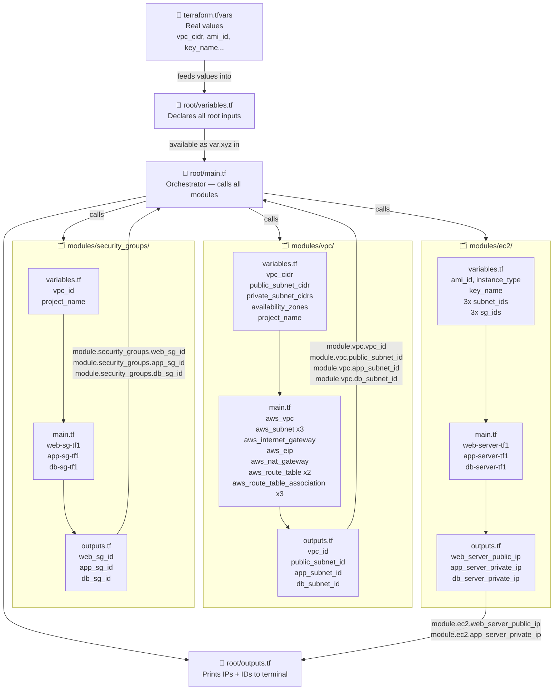

---

## Module 1 — VPC

**What it does:** Builds the entire network — VPC, subnets, IGW, NAT Gateway, and route tables.

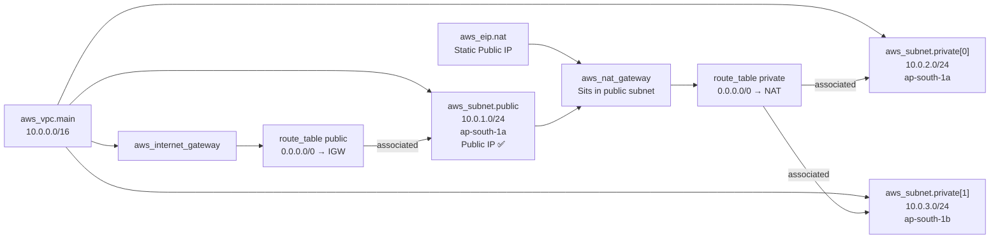

| Resource | Name Tag | Purpose |
|---|---|---|
| `aws_vpc` | `myproject-vpc-tf1` | Isolated network container |
| `aws_subnet` public | `myproject-public-tf1` | Web tier, auto public IP |
| `aws_subnet` private[0] | `myproject-private-tf1` | App tier, no public IP |
| `aws_subnet` private[1] | `myproject-db-private-tf1` | DB tier, separate AZ |
| `aws_internet_gateway` | `myproject-igw-tf1` | Door to internet for public subnet |
| `aws_eip` | `myproject-nat-eip-tf1` | Static IP required by NAT Gateway |
| `aws_nat_gateway` | `myproject-nat-tf1` | Outbound-only internet for private subnets |
| `aws_route_table` public | `myproject-public-rt-tf1` | Routes 0.0.0.0/0 → IGW |
| `aws_route_table` private | `myproject-private-rt-tf1` | Routes 0.0.0.0/0 → NAT |

**NAT Gateway vs Internet Gateway:**
```
Internet Gateway  → two-way  → public subnet  (web-server can receive inbound)
NAT Gateway       → one-way  → private subnet (app/db can call out, nobody can call in)
```

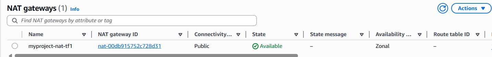 

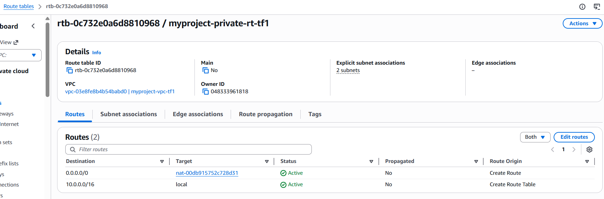


**Key concept — `count` for looping:**
```hcl
resource "aws_subnet" "private" {
  count             = 2                                      # loops twice
  cidr_block        = var.private_subnet_cidrs[count.index]  # [0]=app [1]=db
  availability_zone = var.availability_zones[count.index]
}
```

**Outputs passed to other modules:**
```
vpc_id            → security_groups module
public_subnet_id  → ec2 module (web-server placement)
app_subnet_id     → ec2 module (app-server placement)
db_subnet_id      → ec2 module (db-server placement)
```

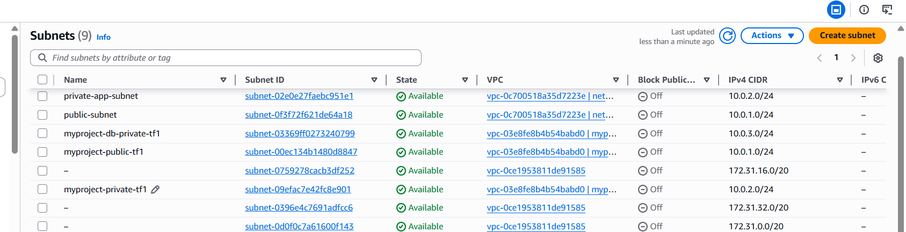 — VPC and subnet list from AWS console
 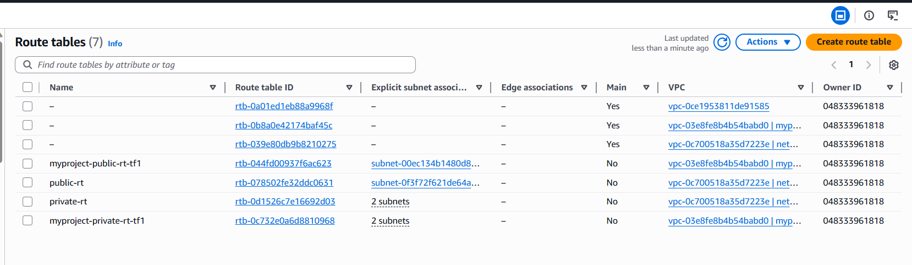 — Route tables showing public/private separation
---

## Module 2 — Security Groups

**What it does:** Creates 3 security groups with strict chaining — each tier only accepts traffic from the tier directly above it.

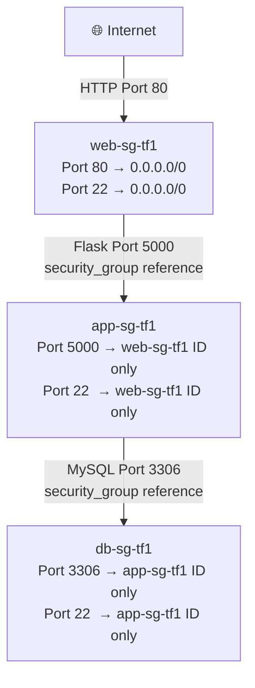

**Security group chaining — the key pattern:**
```hcl
# NOT a CIDR range like "10.0.0.0/16"
# Reference the actual security group ID instead
ingress {
  from_port       = 5000
  security_groups = [aws_security_group.web_sg.id]
}
```
Even an EC2 inside the same VPC **cannot** reach the app tier unless it belongs to `web-sg-tf1`. Identity-based access — not IP-based.

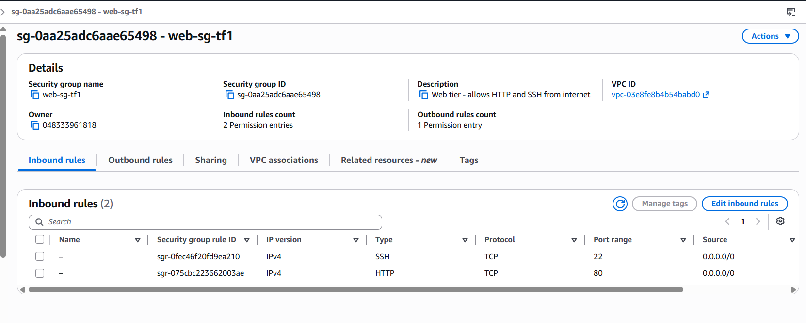 — web-sg inbound rules in AWS console
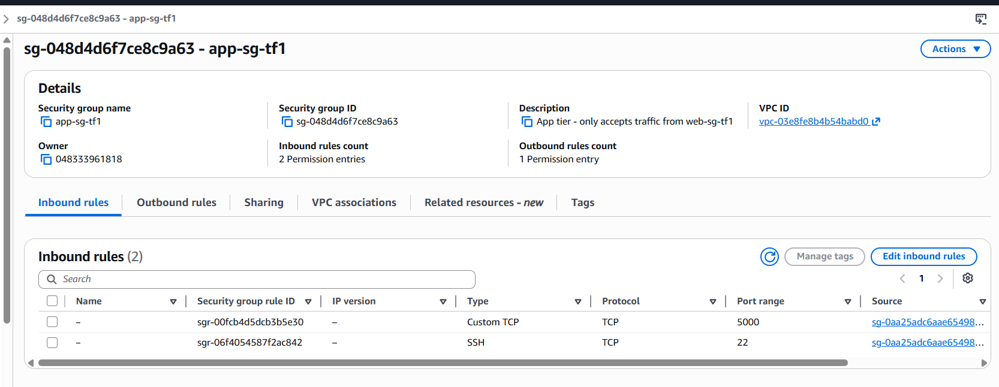 — app-sg showing source as web-sg ID
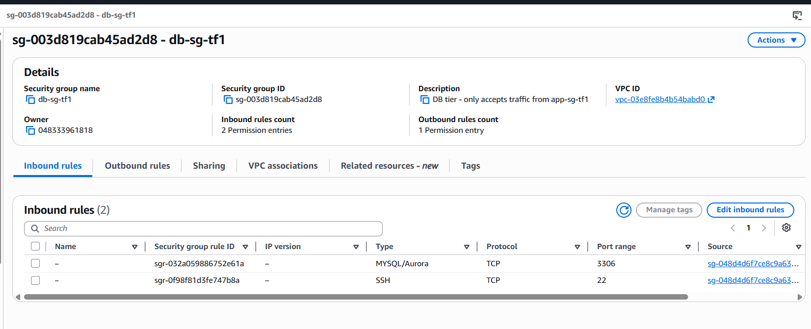 — db-sg showing source as app-sg ID

---

## Module 3 — EC2

**What it does:** Deploys 3 servers, each placed in the correct subnet with the correct security group attached.

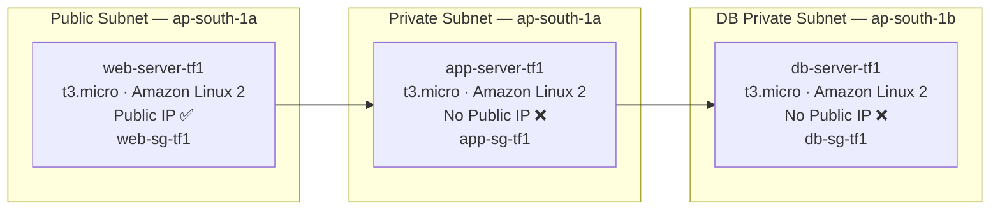

| Server | Subnet | Public IP | Security Group | Role |
|---|---|---|---|---|
| `web-server-tf1` | public-tf1 | ✅ Yes | web-sg-tf1 | Nginx reverse proxy |
| `app-server-tf1` | private-tf1 | ❌ No | app-sg-tf1 | Flask API |
| `db-server-tf1` | db-private-tf1 | ❌ No | db-sg-tf1 | MariaDB |

**Spec (all 3 instances):**
```
AMI           : ami-00c5d5e886a26d124  (Amazon Linux 2, Mumbai)
Instance type : t3.micro
Key pair      : network-lab-key
```

**Outputs printed to terminal after apply:**
```bash
web_server_public_ip   = "13.235.xx.xx"   # open in browser
app_server_private_ip  = "10.0.2.x"       # SSH jump / Flask config
db_server_private_ip   = "10.0.3.x"       # MariaDB connection string
```

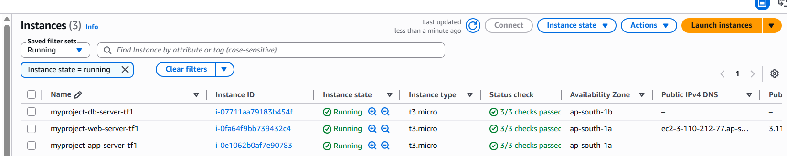 
---

## Root Files

### `root/main.tf` — The Orchestrator

Calls every module and wires outputs between them. Modules **never talk to each other directly** — everything routes through here.

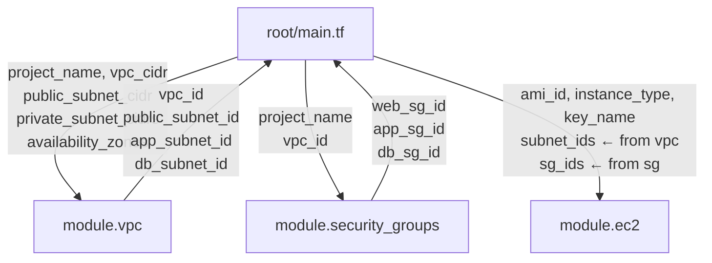

### `terraform.tfvars` — Your Values (gitignored)

The **only file** you edit when switching environments. Same modules, different values = different environment.

```hcl
aws_region           = "ap-south-1"
project_name         = "myproject"
vpc_cidr             = "10.0.0.0/16"
public_subnet_cidr   = "10.0.1.0/24"
private_subnet_cidrs = ["10.0.2.0/24", "10.0.3.0/24"]
availability_zones   = ["ap-south-1a", "ap-south-1b"]
ami_id               = "ami-00c5d5e886a26d124"
instance_type        = "t3.micro"
key_name             = "network-lab-key"
```

### `backend.tf` — State Config (empty for now)

Local state used during learning. For teams: migrate to S3 + DynamoDB.

```hcl
# Future upgrade when working in teams
terraform {
  backend "s3" {
    bucket         = "myproject-tfstate"
    key            = "3tier/terraform.tfstate"
    region         = "ap-south-1"
    dynamodb_table = "myproject-tf-locks"
  }
}
```

---

## Terraform Commands

```bash
# 1. First time setup — downloads AWS provider, initialises modules
terraform init

# 2. Preview what will be created — NO changes made to AWS
terraform plan

# 3. Save plan to file — what you reviewed = exactly what runs
terraform plan -out=tfplan

# 4. Apply the saved plan
terraform apply tfplan

# 5. Apply without saved plan — asks for confirmation
terraform apply

# 6. Tear everything down — removes ALL resources including NAT Gateway
terraform destroy

# 7. Print outputs again without re-applying
terraform output

# 8. List every resource Terraform is tracking
terraform state list
```

**Why save a plan?**
```
terraform plan -out=tfplan   ← snapshot of what WILL happen
terraform apply tfplan        ← applies that exact snapshot
                                what you reviewed = what runs ✅
```

---

## State File

```
terraform.tfstate   ← auto-created after first apply
                      tracks every resource Terraform manages
                      NEVER edit manually
                      NEVER commit to Git  ← already in .gitignore
```

**`terraform destroy` removes everything tracked in state:**
```
NAT Gateway    ✅ destroyed
Elastic IP     ✅ destroyed
EC2 instances  ✅ destroyed
Security Groups✅ destroyed
Subnets        ✅ destroyed
VPC            ✅ destroyed
Zero cost after destroy ✅
```

---

## `.gitignore` (Already Configured)

```
*.tfstate          # never commit state
*.tfstate.*
.terraform/        # provider binaries
.terraform.lock.hcl
*.tfvars           # never commit real values
```

> Always commit `terraform.tfvars.example` with dummy values so anyone cloning knows the required inputs.

---

## Resource Summary

| Module | Resources Created | Outputs Exposed |
|---|---|---|
| vpc | 11 | 4 |
| security_groups | 3 | 3 |
| ec2 | 3 | 6 |
| **Total** | **17** | **13** |

---

> **Revision tip:** Value flow is always one direction —
> `tfvars → root variables → root main → module variables → module main → module outputs → root main → root outputs`
> Follow that chain on any Terraform project and it will make sense immediately.
