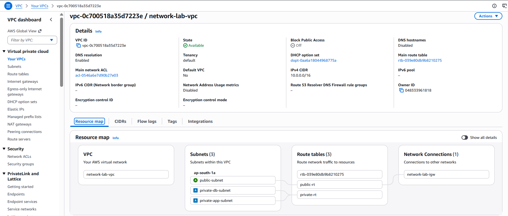
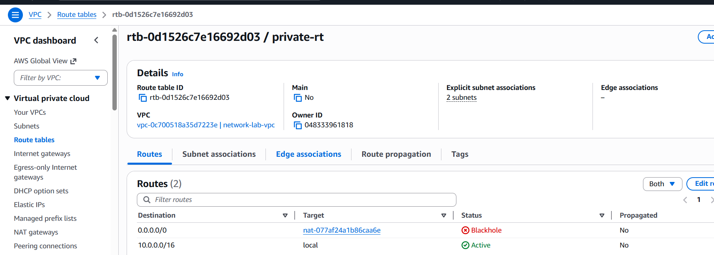
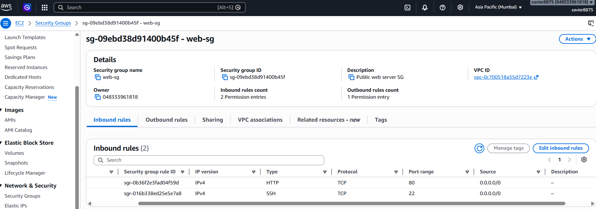
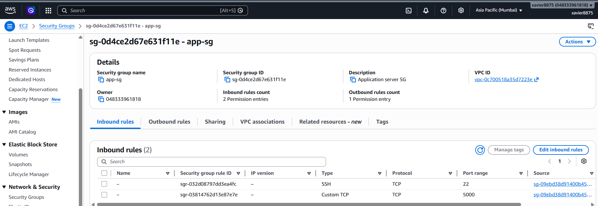
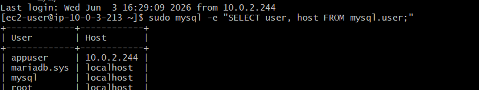
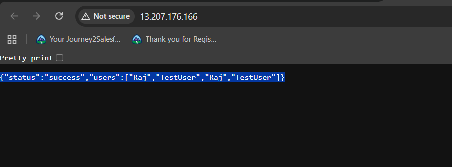

# AWS 3-Tier Architecture - Manual Setup Steps

This guide walks through manually setting up a production-style 3-tier architecture on AWS.

## Step 1: VPC and Subnets Configuration

Configure a custom Virtual Private Cloud (VPC) to isolate the web, application, and database tiers inside distinct network segments.

## Step 2: NAT Gateway and Route Tables

Configure routing tables to establish secure outbound-only internet connectivity for instances residing within the private subnets.

**Tasks:**
- **Configured Private Routing:** Created a private route table (`private-rt` / ID: `rtb-0d1526c7e16692d03`) explicitly associated with the 2 private internal subnets.
- **Created Outbound Egress Target:** Added a default route matching `0.0.0.0/0` targeting a managed NAT Gateway (`nat-077af24a1b86caa6e`) to enable internal application builds to run updates safely.
- **Cost Optimization Note:** As displayed in the verification log above, the NAT Gateway was successfully deleted post-validation to manage running infrastructure costs cleanly, transitioning the active target routing status to a safe `Blackhole` state before automation.

## Step 3: Security Groups Configuration

Enforce a strict stateful firewall network policy across all three tiers using the principle of least privilege via explicit Security Group chaining.

**Tasks:**
- **Configured Web Tier Security (`web-sg` / `sg-09ebd38d91400b45f`):** - Exposed Port `80` (HTTP) to the public internet (`0.0.0.0/0`) to process user client web queries.
  - Allowed inbound Port `22` (SSH) universally for initial edge administrative entry.
- **Configured Application Tier Security (`app-sg` / `sg-0d4ce2d67e631f11e`):**
  - Restricted entry on Port `5000` (Flask custom API) to originate **only** from instances matching the explicit `web-sg` group security ID.
  - Locked down administrative Port `22` (SSH) to pass exclusively through the proxy layer (`web-sg`).
- **Configured Database Tier Security (`db-sg` / `sg-0b16813f90f88c759`):**
  - Protected database transactional layer entry on Port `3306` (MySQL/MariaDB) by ensuring incoming traffic passes **exclusively** from the application middleware security profile (`app-sg`).
  - Strict host containment for Port `22` (SSH) allowing internal jump-box access solely from the `app-sg` tier.

  ## Step 4: EC2 Instances Provisioning

Deploy three dedicated Amazon EC2 instances across the public and private subnets to isolate the distinct application layers, assigning custom security groups to establish deep perimeter control.

**Tasks:**
- **Provisioned Web Proxy Server (`web-server`):** Deployed an EC2 instance within the public subnet acting as the public entry gateway. This host manages external traffic rules and is bound tightly to `web-sg`.
- **Provisioned Application Middleware Server (`app-server`):** Deployed an EC2 instance inside the isolated private application subnet to execute internal python/Flask process logic, completely hidden from direct internet exposure and bound to `app-sg`.
- **Provisioned Transactional Database Server (`db-server`):** Deployed an EC2 instance inside the deep private database subnet to host the relational data engine safely, bound strictly to `db-sg`.

## Step 5: Database and Permissions

Initialize the transactional database tier on an isolated EC2 host running MariaDB, enforcing database-level authentication scope limitations.

**Tasks:**
- **Deployed EC2 Database Tier:** Provisioned a dedicated EC2 instance inside the private database subnet with MariaDB Server initialized.
- **Enforced Relational Scope Hardening:** Created a relational database schema (`myproject`) and decoupled the standard administrative access properties.
- **Configured Strict Ingress Bindings:** Explicitly restricted application account credentials (`appuser`) to accept queries **exclusively** from the application middleware system network layer host, denying access from all other internal or external identities.

## Step 6: Application Deployment Verification

Verify the successful end-to-end integration of the manual 3-tier architecture stack by validating live data retrieval from the client browser.

**Tasks:**
- **Validated Front-End Proxy Ingress:** Confirmed that Nginx on `web-server` actively processes incoming public HTTP traffic on port `80` and proxies it down the network stack.
- **Verified Internal Application Routing:** Confirmed the Flask WSGI application on `app-server` successfully processes requests routed from the proxy layer on private port `5000`.
- **Validated Relational Data Connectivity:** Verified the application server successfully authenticated with MariaDB on `db-server` via port `3306` over the isolated private subnet path.
- **Confirmed End-to-End Execution:** Successfully generated a dynamic, live database response payload showing structured user table entry records directly on the client web browser screen.
